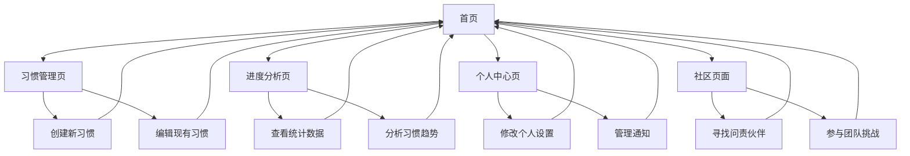

# 习惯追踪器产品需求文档

## 1. 产品概述

习惯追踪器是一款现代化的Web应用，旨在帮助用户建立和维持良好的生活习惯。产品结合了行为科学原理和现代游戏化设计，为用户提供简洁而有效的习惯管理体验。

产品解决用户在习惯养成过程中缺乏持续动力和有效追踪的问题，通过科学的反馈机制和激励系统，帮助用户建立长期的行为改变。目标是成为用户日常生活中不可或缺的自我提升工具，在竞争激烈的习惯追踪市场中建立差异化优势。

## 2. 核心功能

### 2.1 用户角色

| 角色 | 注册方式 | 核心权限 |
|------|----------|----------|
| 普通用户 | 邮箱注册或社交登录 | 创建和追踪基础习惯，查看个人进度 |
| 高级用户 | 订阅升级 | 解锁高级功能如AI教练、团队挑战、详细分析 |

### 2.2 功能模块

我们的习惯追踪器包含以下核心页面：

1. **首页**：用户仪表板、今日习惯概览、快速签到
2. **习惯管理页**：创建习惯、编辑设置、分类管理
3. **进度分析页**：数据可视化、连续记录统计、趋势分析
4. **个人中心页**：用户设置、通知配置、账户管理
5. **社区页面**：问责伙伴、团队挑战、进度分享

### 2.3 页面详情

| 页面名称 | 模块名称 | 功能描述 |
|----------|----------|----------|
| 首页 | 用户仪表板 | 显示今日待完成习惯、连续记录概览、快速操作按钮 |
| 首页 | 今日习惯 | 一键签到完成习惯、查看今日进度、习惯状态切换 |
| 首页 | 激励元素 | 连续记录展示、成就徽章、进度条可视化 |
| 习惯管理页 | 习惯创建 | 设置习惯名称、选择图标、配置重复规则（每日/每周/自定义） |
| 习惯管理页 | 习惯分类 | 支持正向习惯（需要养成）和负向习惯（需要戒除）管理 |
| 习惯管理页 | 提醒设置 | 配置时间提醒、自定义通知文案、提醒频率设置 |
| 进度分析页 | 数据可视化 | 日历热力图、趋势图表、完成率统计 |
| 进度分析页 | 连续记录 | 当前连续天数、历史最佳记录、连续记录排行 |
| 进度分析页 | 习惯洞察 | 完成模式分析、最佳时间段识别、改进建议 |
| 个人中心页 | 用户设置 | 个人信息编辑、偏好设置、隐私控制 |
| 个人中心页 | 通知管理 | 推送通知开关、提醒时间设置、通知类型选择 |
| 个人中心页 | 数据管理 | 数据导出、备份恢复、账户删除 |
| 社区页面 | 问责伙伴 | 添加好友、分享进度、互相鼓励消息 |
| 社区页面 | 团队挑战 | 创建或加入挑战、团队排行榜、集体目标 |
| 社区页面 | 成就分享 | 里程碑庆祝、社区动态、点赞评论 |

## 3. 核心流程

### 普通用户流程
用户首次访问应用后，通过简单的引导流程创建账户并设置第一个习惯。每日用户打开应用查看今日待完成的习惯，通过一键操作完成签到。用户可以查看自己的连续记录和进度统计，获得成就感和持续动力。当用户需要调整习惯或查看详细分析时，可以进入相应的管理和分析页面。

### 高级用户流程
高级用户除了享有普通用户的所有功能外，还可以访问AI教练功能获得个性化建议，参与团队挑战与其他用户互动，使用高级分析功能深入了解自己的习惯模式。

## 4. 用户界面设计

### 4.1 设计风格

- **主色调**：清新的蓝绿色系（#10B981）作为主色，传达成长和活力
- **辅助色**：温暖的橙色（#F59E0B）用于强调和奖励元素
- **按钮样式**：圆角设计（8px border-radius），现代简洁的扁平化风格
- **字体**：Inter字体系列，14px为基础字号，16px为标题字号
- **布局风格**：卡片式布局，顶部导航栏，响应式网格系统
- **图标风格**：使用Heroicons图标库，线性风格，保持一致性

### 4.2 页面设计概览

| 页面名称 | 模块名称 | UI元素 |
|----------|----------|--------|
| 首页 | 用户仪表板 | 清洁的白色背景，卡片式布局，绿色进度条，圆形头像 |
| 首页 | 今日习惯 | 大号复选框，习惯图标，连续记录数字徽章，滑动手势支持 |
| 习惯管理页 | 习惯创建 | 模态对话框，图标选择器，颜色选择器，表单验证提示 |
| 进度分析页 | 数据可视化 | Chart.js图表，日历热力图，渐变色进度环，动画过渡 |
| 个人中心页 | 设置界面 | 列表式布局，开关组件，分组标题，右箭头导航 |
| 社区页面 | 社交功能 | 用户头像网格，活动时间线，点赞按钮，评论气泡 |

### 4.3 响应式设计

产品采用移动优先的响应式设计策略，确保在手机、平板和桌面设备上都有良好的用户体验。针对触屏设备优化交互，包括适当的触摸目标大小（最小44px）和手势操作支持。桌面版本利用更大的屏幕空间提供更丰富的数据展示和多列布局。