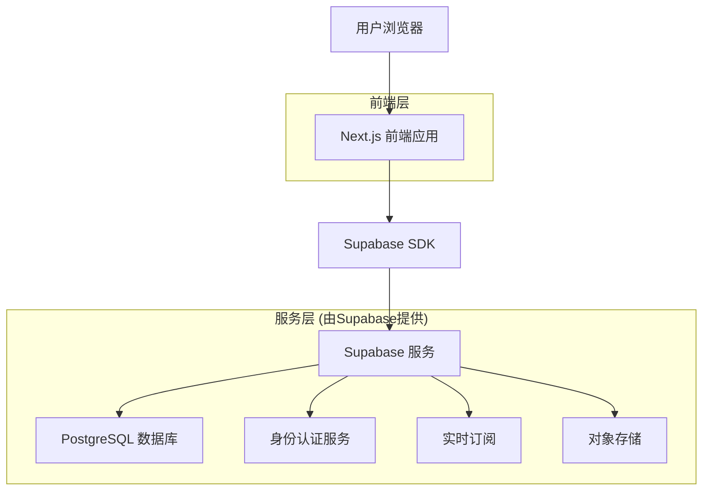
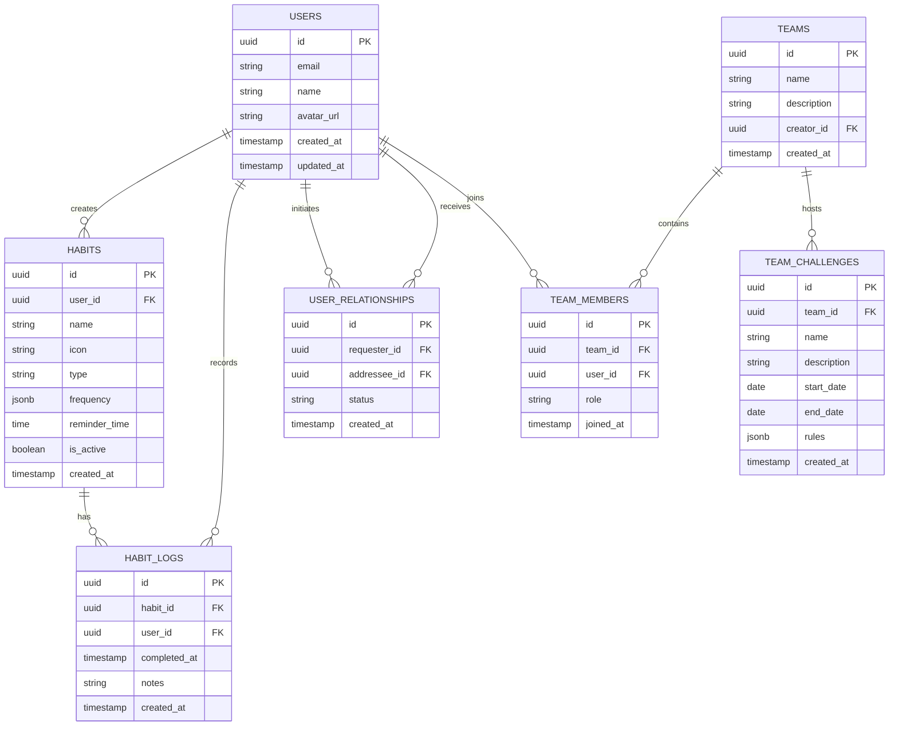

# 习惯追踪器技术架构文档

## 1. 架构设计



## 2. 技术描述

- 前端：Next.js@14 + React@18 + TypeScript + Tailwind CSS@3 + Framer Motion
- 后端：Supabase (PostgreSQL + 身份认证 + 实时功能)
- 部署：Vercel (前端) + Supabase Cloud (后端服务)
- 状态管理：Zustand
- UI组件：Headless UI + Heroicons
- 图表库：Chart.js + React-Chartjs-2
- 通知：Web Push API + Supabase Edge Functions

## 3. 路由定义

| 路由 | 用途 |
|------|------|
| / | 首页，显示用户仪表板和今日习惯概览 |
| /habits | 习惯管理页面，创建和编辑习惯 |
| /analytics | 进度分析页面，数据可视化和统计 |
| /profile | 个人中心，用户设置和账户管理 |
| /community | 社区页面，问责伙伴和团队挑战 |
| /auth/login | 登录页面，用户身份验证 |
| /auth/register | 注册页面，新用户账户创建 |
| /onboarding | 引导页面，首次使用指导 |

## 4. API定义

### 4.1 核心API

**用户认证相关**
```
POST /auth/v1/signup
```

请求参数：
| 参数名 | 参数类型 | 是否必需 | 描述 |
|--------|----------|----------|------|
| email | string | true | 用户邮箱地址 |
| password | string | true | 用户密码 |
| name | string | true | 用户姓名 |

响应：
| 参数名 | 参数类型 | 描述 |
|--------|----------|------|
| user | object | 用户信息对象 |
| session | object | 会话信息 |

**习惯管理相关**
```
POST /rest/v1/habits
```

请求参数：
| 参数名 | 参数类型 | 是否必需 | 描述 |
|--------|----------|----------|------|
| name | string | true | 习惯名称 |
| icon | string | false | 习惯图标 |
| type | string | true | 习惯类型 (positive/negative) |
| frequency | object | true | 重复频率配置 |
| reminder_time | string | false | 提醒时间 |

响应示例：
```json
{
  "id": "uuid",
  "name": "每日阅读",
  "icon": "book",
  "type": "positive",
  "frequency": {
    "type": "daily",
    "days": [1,2,3,4,5,6,7]
  },
  "created_at": "2024-01-01T00:00:00Z"
}
```

**习惯记录相关**
```
POST /rest/v1/habit_logs
```

请求参数：
| 参数名 | 参数类型 | 是否必需 | 描述 |
|--------|----------|----------|------|
| habit_id | uuid | true | 习惯ID |
| completed_at | timestamp | true | 完成时间 |
| notes | string | false | 备注信息 |

## 5. 数据模型

### 5.1 数据模型定义



### 5.2 数据定义语言

**用户表 (users)**
```sql
-- 用户表由Supabase Auth自动创建和管理
-- 扩展用户配置表
CREATE TABLE user_profiles (
    id UUID PRIMARY KEY REFERENCES auth.users(id) ON DELETE CASCADE,
    name VARCHAR(100) NOT NULL,
    avatar_url TEXT,
    timezone VARCHAR(50) DEFAULT 'UTC',
    notification_enabled BOOLEAN DEFAULT true,
    created_at TIMESTAMP WITH TIME ZONE DEFAULT NOW(),
    updated_at TIMESTAMP WITH TIME ZONE DEFAULT NOW()
);

-- 启用行级安全
ALTER TABLE user_profiles ENABLE ROW LEVEL SECURITY;

-- 创建策略
CREATE POLICY "Users can view own profile" ON user_profiles
    FOR SELECT USING (auth.uid() = id);

CREATE POLICY "Users can update own profile" ON user_profiles
    FOR UPDATE USING (auth.uid() = id);
```

**习惯表 (habits)**
```sql
CREATE TABLE habits (
    id UUID PRIMARY KEY DEFAULT gen_random_uuid(),
    user_id UUID NOT NULL REFERENCES auth.users(id) ON DELETE CASCADE,
    name VARCHAR(100) NOT NULL,
    icon VARCHAR(50) DEFAULT 'star',
    type VARCHAR(20) NOT NULL CHECK (type IN ('positive', 'negative')),
    frequency JSONB NOT NULL DEFAULT '{"type": "daily", "days": [1,2,3,4,5,6,7]}',
    reminder_time TIME,
    is_active BOOLEAN DEFAULT true,
    created_at TIMESTAMP WITH TIME ZONE DEFAULT NOW(),
    updated_at TIMESTAMP WITH TIME ZONE DEFAULT NOW()
);

-- 创建索引
CREATE INDEX idx_habits_user_id ON habits(user_id);
CREATE INDEX idx_habits_active ON habits(user_id, is_active);

-- 启用行级安全
ALTER TABLE habits ENABLE ROW LEVEL SECURITY;

-- 创建策略
CREATE POLICY "Users can manage own habits" ON habits
    FOR ALL USING (auth.uid() = user_id);

-- 授权
GRANT SELECT ON habits TO anon;
GRANT ALL PRIVILEGES ON habits TO authenticated;
```

**习惯记录表 (habit_logs)**
```sql
CREATE TABLE habit_logs (
    id UUID PRIMARY KEY DEFAULT gen_random_uuid(),
    habit_id UUID NOT NULL REFERENCES habits(id) ON DELETE CASCADE,
    user_id UUID NOT NULL REFERENCES auth.users(id) ON DELETE CASCADE,
    completed_at TIMESTAMP WITH TIME ZONE NOT NULL,
    notes TEXT,
    created_at TIMESTAMP WITH TIME ZONE DEFAULT NOW()
);

-- 创建索引
CREATE INDEX idx_habit_logs_habit_id ON habit_logs(habit_id);
CREATE INDEX idx_habit_logs_user_id ON habit_logs(user_id);
CREATE INDEX idx_habit_logs_completed_at ON habit_logs(completed_at DESC);

-- 创建唯一约束（防止同一天重复记录）
CREATE UNIQUE INDEX idx_habit_logs_unique_daily ON habit_logs(habit_id, DATE(completed_at));

-- 启用行级安全
ALTER TABLE habit_logs ENABLE ROW LEVEL SECURITY;

-- 创建策略
CREATE POLICY "Users can manage own habit logs" ON habit_logs
    FOR ALL USING (auth.uid() = user_id);

-- 授权
GRANT SELECT ON habit_logs TO anon;
GRANT ALL PRIVILEGES ON habit_logs TO authenticated;
```

**用户关系表 (user_relationships)**
```sql
CREATE TABLE user_relationships (
    id UUID PRIMARY KEY DEFAULT gen_random_uuid(),
    requester_id UUID NOT NULL REFERENCES auth.users(id) ON DELETE CASCADE,
    addressee_id UUID NOT NULL REFERENCES auth.users(id) ON DELETE CASCADE,
    status VARCHAR(20) NOT NULL DEFAULT 'pending' CHECK (status IN ('pending', 'accepted', 'rejected')),
    created_at TIMESTAMP WITH TIME ZONE DEFAULT NOW(),
    updated_at TIMESTAMP WITH TIME ZONE DEFAULT NOW()
);

-- 创建唯一约束
CREATE UNIQUE INDEX idx_user_relationships_unique ON user_relationships(requester_id, addressee_id);

-- 启用行级安全
ALTER TABLE user_relationships ENABLE ROW LEVEL SECURITY;

-- 创建策略
CREATE POLICY "Users can manage own relationships" ON user_relationships
    FOR ALL USING (auth.uid() = requester_id OR auth.uid() = addressee_id);

-- 授权
GRANT ALL PRIVILEGES ON user_relationships TO authenticated;
```

**初始化数据**
```sql
-- 创建触发器函数用于自动更新时间戳
CREATE OR REPLACE FUNCTION update_updated_at_column()
RETURNS TRIGGER AS $$
BEGIN
    NEW.updated_at = NOW();
    RETURN NEW;
END;
$$ language 'plpgsql';

-- 为相关表添加更新时间戳触发器
CREATE TRIGGER update_user_profiles_updated_at BEFORE UPDATE ON user_profiles
    FOR EACH ROW EXECUTE FUNCTION update_updated_at_column();

CREATE TRIGGER update_habits_updated_at BEFORE UPDATE ON habits
    FOR EACH ROW EXECUTE FUNCTION update_updated_at_column();

CREATE TRIGGER update_user_relationships_updated_at BEFORE UPDATE ON user_relationships
    FOR EACH ROW EXECUTE FUNCTION update_updated_at_column();
```